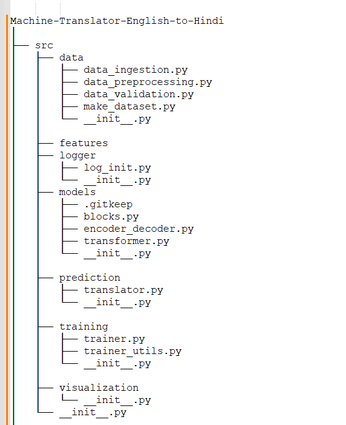
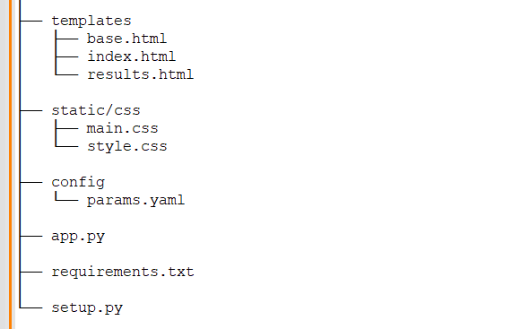
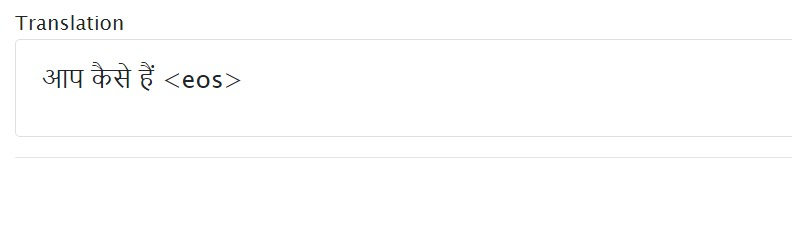

# Machine-Translator-English-to-Hindi

## 🪄 About
This is a Natural Language Processing(NLP) project. The project aims at building a NLP model which can convert the text from English language to Hindi language using Transformers.

The project was created using Python Flask framework.

## 🏋🏻‍♂️ Motivation
Hindi(हिन्दी) is the National language in India, and one of the official languages of the Government of India. It is an official language in nine states and three union territories and an additional official language in three other states in India. Hindi is also one of the 22 scheduled languages of the Republic of India.
So, a person travelling across the Nation need Hindi to be known. So, we build this project for translating the language from English to Hindi.

## 📈 DataSource

We have collected data from various data sources available in internet like 3rd party API's, Wikipedia etc. Seggregated and preprocessed the data to proper format for model training. After preprocessing, the corpus contains English documents with appropriate Hindi text.

## 🗂️ Project Directory tree

<a></a><br>
<a></a>

## 💻 Web UI

### Entering Input text in English
<a></a>

### Getting Hindi(हिन्दी) text as Output

<a></a>


## 🖥️ Installation

### 🛠️ Requirement packages
* numpy  
* pandas
* matplotlib
* sklearn
* Flask
* click
* Sphinx
* coverage
* flake8
* python-dotenv
* setuptools
* pyyaml
* tqdm
* spacy
* torchtext
* indic-nlp-library

### ⚙️ SetUp

1. Creating conda environment
 ``` 
 conda create -p venv python==3.7 -y 
 ```

2. For activating environment
```
"conda activate venv/"
```
3. For installing packages in requirements.txt
```
pip install -r requirements.txt
```

4. To add files to git
```
git add <file_name> => for adding single file to git.
git add . => for adding all the files to your local git.
```
5. To check the git status
```
git status
```
6. To create version/commit all the changes to git

```
git commit -m "Message"
```
7. To send version/changes to github.
```
git push origin main
```

## 🦾 Tools & Technogies Used


## ✍️ Author

@Ravi Teja Mandarapu
